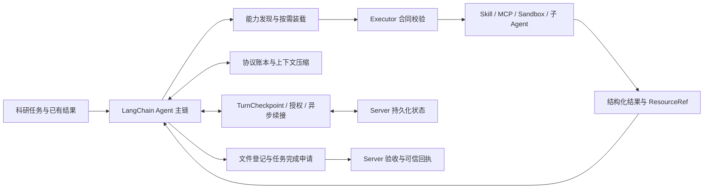

# EvoEngine · Engineering Portfolio

面向生物科研长任务 Agent 的工程实现选编：模型决策、多类工具执行、长上下文、异步恢复、科研证据与可信交付。

项目早期以知识检索和问答为主，随后需要根据中间结果继续调用工具，处理长时间计算、人工确认与文件交付。我主要负责 Agent 主链搭建，以及能力集成、上下文治理、Checkpoint 恢复、证据链和完成合同的方案、集成与验证。开发中大量使用 AI 辅助编码。

这里展示冻结版本中的真实模块和完整函数节选，并串起类型、调用者、执行逻辑与原有测试。它是工程阅读版，保留原实现；运行所需的完整服务、配置和外部依赖不在本仓库中。

## 从简历要点进入实现

| 专题 | 技术说明与代码导航 |
| --- | --- |
| 01 | [Agent 主链与事件流](docs/01-agent-loop.md) |
| 02 | [统一能力合同、发现与 Provider](docs/02-capabilities.md) |
| 03 | [调用身份、结果账本与幂等](docs/03-call-identity.md) |
| 04 | [资源引用与长上下文治理](docs/04-context.md) |
| 05 | [Checkpoint、异步作业与授权恢复](docs/05-resume.md) |
| 06 | [检索子 Agent、来源身份与 EvidencePack](docs/06-evidence.md) |
| 07 | [文件血缘、完成验收与可信回执](docs/07-delivery.md) |

建议先读主链，再沿自己的关注点进入专题。每章先说明输入、变量与执行过程，再给实现和测试入口。

## 阅读与验证边界

- **来源**：Agent `057cdcb9c61e`、Server `8ee96f3171f2`，2026-08-25 冻结归档；[逐文件清单](source_manifest.json)记录完整 commit、原路径、行号、哈希及整理方式。
- **真实实现**：55 个 Python 文件，其中 49 个为归档字节一致副本，其余为完整函数/类节选。没有新增替代 Agent 或模拟历史贡献。
- **当前检查（2026-09-14）**：静态阅读关键链路、来源范围核对、Python AST 解析和文档链接检查；未运行原项目、测试、模型或生产服务。
- **历史测试**：随代码保留原有断言和测试上下文，不把测试文件存在记作本轮通过。完整任务恢复、科学结论、性能和线上可用性均不由本仓库单独证明。
- **归属**：本人工作包括方案取舍、实现、集成、诊断与验证；不把工程中的每一行或其他作者历史都归为本人手写。

更多说明：[来源与范围](docs/PROVENANCE.md) · [依赖和运行边界](docs/DEPENDENCIES.md) · [本次静态检查](docs/VERIFICATION.md)。

本仓库按作者对本次选编范围的确认，用于公开技术展示。保留原始来源与归属说明，未额外附加开源许可证。
